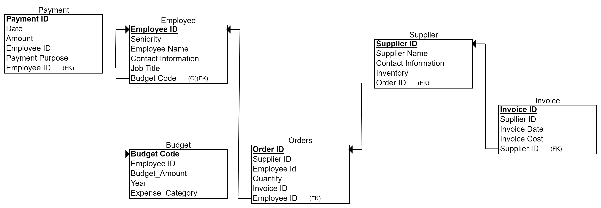
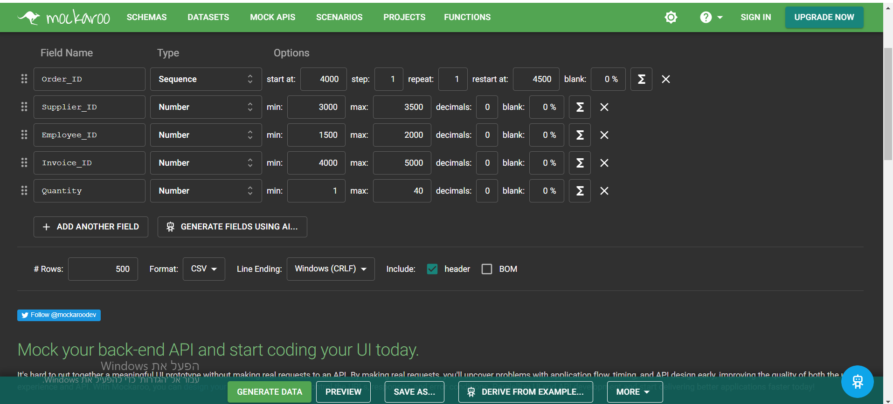

•	Shay Mordechai			315689042

•	Yair Miller			314695438

                                                **School Management System**

**Description:**

This system is designed to manage a school's administrative operations, including employee information, budgeting, procurement, and financial transactions.

Data Entities:

•	***Employee*** ( **Employee_ID**,Employee_Name, Seniority, Contact_Information )

•	***Budget*** ( **Budget_Code**, _Employee_ID_, Expense_Category, Budget_Amount, Budget_Year)

•	***Supplier*** ( **Supplier_ID**, Supplier_Name, Contact_Information, Inventory )

•	***Invoice*** ( **Invoice_ID**, _Supplier_ID_, Invoice_Cost, Invoice_Date )

•	***Orders*** ( **Order_ID**, _Supplier_ID_, _Employee_ID_, Quantity )

•	***Payment*** ( **Payment_ID**, _Employee_ID_, Amount, Payment_Purpose, Payment_Date )

**Relationships:**

• An _Employee_ may be associated with multiple _Budgets_ (via Employee_ID in Budget).

• An _Employee_ can initiate multiple Orders and receive multiple _Payments_ (via Employee_ID in Orders and Payment).

• A _Supplier_ can have multiple _Orders_ placed with them (via Supplier_ID in Orders).

• Each _Order_ is tied to a single Supplier and a single _Invoice_ (via Supplier_ID and Order_ID in foreign keys).

• Each _Invoice_ is linked to a single _Order_ (via Order_ID in foreign key).

• Each _Supplier_ must have exactly one Invoice associated with them, and each Invoice must be associated with exactly one _Supplier_.

**Functionality:**

This database schema allows you to manage various aspects of a school's financial operations:

•	 Record and manage employee information, including their roles and contact details.

• Define and track budgets allocated to different expense categories, ensuring efficient financial management.

• Maintain supplier details, including their names, contact information, and inventory levels (if applicable).

• Create and manage purchase orders placed with suppliers, tracking details such as order quantities and delivery dates.

• Process invoices received from suppliers for placed orders, ensuring accurate billing and payment reconciliation.

• Record payments made to employees for salaries, bonuses, or grants, enabling efficient payroll processing and financial reporting.

**Create Tables:**

CREATE TABLE Employee (

    Employee_ID NUMBER(4) PRIMARY KEY,
   
    Employee_Name VARCHAR(30),
   
    Seniority NUMBER(5),
   
    Contact_Information VARCHAR(50),
   
    Job_Title  VARCHAR(30) CHECK (Job_Title IN ('Budget Committee', 'Procurement Manager', 'Worker'))   
);

CREATE TABLE Budget (

    Budget_Code INT PRIMARY KEY,
   
    Employee_ID NUMBER(4), -- Each budget must be associated with an employee
   
    Expense_Category VARCHAR(50),
   
    Budget_Amount DECIMAL(10,2),
   
    Budget_Year NUMBER(4),
   
    FOREIGN KEY (Employee_ID) REFERENCES Employee(Employee_ID)
  );

CREATE TABLE Supplier (

    Supplier_ID INT PRIMARY KEY,
    
    Supplier_Name VARCHAR(30),
   
    Contact_Information VARCHAR(50),
   
    Inventory DECIMAL(10,2)
  );

CREATE TABLE Invoice (

    Invoice_ID INT PRIMARY KEY,
    
    Supplier_ID INT, -- Each invoice must be associated with a supplier
    
    Invoice_Cost DECIMAL(10,2),
    
    Invoice_Date DATE,
    
    FOREIGN KEY (Supplier_ID) REFERENCES Supplier(Supplier_ID)
    
  );

  CREATE TABLE Orders (
    
    Order_ID INT PRIMARY KEY,
    
    Supplier_ID INT, -- Each order must be associated with a supplier
    
    Employee_ID INT, -- Each order must be associated with an employee
    
    Invoice_ID INT,
    
    Quantity INT,
    
    FOREIGN KEY (Employee_ID) REFERENCES Employee(Employee_ID),
    
    FOREIGN KEY (Supplier_ID) REFERENCES Supplier(Supplier_ID),
    
    FOREIGN KEY (Invoice_ID) REFERENCES Invoice(Invoice_ID)
    
  );

  
  CREATE TABLE Payment (
      Payment_ID INT PRIMARY KEY,
      
      Employee_ID INT, -- Each payment must be associated with an employee
      
      Amount DECIMAL(10,2),
      
      Payment_Purpose VARCHAR(20) CHECK (Payment_Purpose IN ('Salary', 'Bonus', 'Grant')),
      
      Payment_Date DATE,
      
      FOREIGN KEY (Employee_ID) REFERENCES Employee(Employee_ID)
      
  );

**ERD:**
 

**DSD:**
 

**Data Generate – Three Ways:**
•	Generate Budget data with Python Script.
 
 
•	Generate Invoice data with Mockaroo’s website.

•	Generate Payment data with Data Generator of PLSQL.
 
 
**Six data imports with PLSQL:**

Employee – 500 records. 

Budget – 477 records. 

Invoice – 500 records. 

Orders – 500 records. 

Payment – 500 records. 

